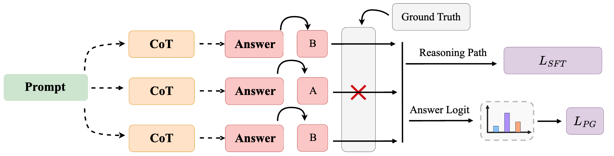

# CompassJudger-2: Towards Generalist Judge Model via Verifiable Rewards


<p align="center">
  <a href="https://github.com/open-compass/opencompass">
    
  </a>
  <a href="https://arxiv.org/abs/2507.09104">
    
  </a>
  <a href="https://huggingface.co/opencompass/CompassJudger-2-7B-Instruct">
    
  </a>
  <a href="https://discord.gg/WgjnuBmDAd">
    
  </a>
</p>

> Taolin Zhang*, Maosong Cao*, Alexander Lam, Songyang Zhang, Kai Chen
>
> Recently, the role of LLM-as-judge in evaluating large language models has gained prominence. However, current judge models suffer from narrow specialization and limited robustness, undermining their capacity for comprehensive  evaluations. In this work, we present \textit{CompassJudger-2}, a novel generalist judge model that overcomes these limitations via a task-driven, multi-domain data curation strategy. Central to our approach is supervising judgment tasks with verifiable rewards, guiding intrinsic critical reasoning through rejection sampling to foster robust, generalizable judgment capabilities. We introduce a refined learning objective with margin policy gradient loss to enhance performance. Empirically, CompassJudger-2 achieves superior results across multiple judge and reward benchmarks, and our 7B model demonstrates competitive judgment accuracy with significantly larger models like DeepSeek-V3 and Qwen3-235B-A22B. Additionally, we propose JudgerBenchV2, a comprehensive benchmark evaluating cross-domain judgment accuracy and rank consistency to standardize judge model evaluation. These contributions advance robust, scalable LLM judgment and establish new performance and evaluation standards.

<p align="center"></p>

## 📢 News

- **July 11, 2025:** Our paper, **CompassJudger-2: Towards Generalist Judge Model via Verifiable Rewards**, is now available.

## 🤗 Models

| Model Name                         | Size | Base Model           |                           Download                           | Notes                                         |
| :--------------------------------- | :--: | :------------------- | :----------------------------------------------------------: | :-------------------------------------------- |
| 👉 **CompassJudger-1-7B-Instruct**  |  7B  | Qwen2.5-7B-Instruct  | 🤗 [Model](https://huggingface.co/opencompass/CompassJudger-1-7B-Instruct) | CompassJudger-1 7B Model. |
| 👉 **CompassJudger-2-32B-Instruct** | 32B  | Qwen2.5-32B-Instruct | 🤗 [Model](https://huggingface.co/opencompass/CompassJudger-1-32B-Instruct) | CompassJudger-1 32B Model.          |
| 👉 **CompassJudger-2-7B-Instruct**  |  7B  | Qwen2.5-7B-Instruct  | 🤗 [Model](https://huggingface.co/opencompass/CompassJudger-2-7B-Instruct) | Fine-tuned for generalist judge capabilities. |
| 👉 **CompassJudger-2-32B-Instruct** | 32B  | Qwen2.5-32B-Instruct | 🤗 [Model](https://huggingface.co/opencompass/CompassJudger-2-32B-Instruct) | A larger, more powerful judge model.          |

## 🔥 Quick Start

```python
import torch
from transformers import AutoModelForCausalLM, AutoTokenizer

model_path = "opencompass/CompassJudger-2-7B-Instruct"

model = AutoModelForCausalLM.from_pretrained(
    model_name,
    torch_dtype="auto",
    device_map="auto"
)
tokenizer = AutoTokenizer.from_pretrained(model_name)

# Example: Pair-wise Comparison
prompt = """
Please act as an impartial judge to evaluate the responses provided by two AI assistants to the user question below. Your evaluation should focus on the following criteria: helpfulness, relevance, accuracy, depth, creativity, and level of detail.

- Do not let the order of presentation, response length, or assistant names influence your judgment.
- Base your decision solely on how well each response addresses the user’s question and adheres to the instructions.

Your final reply must be structured in the following format:
{
  "Choice": "[Model A or Model B]"
}

User Question: {question}

Model A's Response: {answerA}

Model B's Response: {answerB}

Now it's your turn. Please provide selection result as required:
"""

messages = [
    {"role": "user", "content": prompt}
]

text = tokenizer.apply_chat_template(
    messages,
    tokenize=False,
    add_generation_prompt=True
)
model_inputs = tokenizer([text], return_tensors="pt").to(model.device)

generated_ids = model.generate(
    **model_inputs,
    max_new_tokens=2048
)
generated_ids = [
    output_ids[len(input_ids):] for input_ids, output_ids in zip(model_inputs.input_ids, generated_ids)
]

response = tokenizer.batch_decode(generated_ids, skip_special_tokens=True)[0]
print(response)
```

## 📊 JudgerBenchV2

### Evaluate on JudgerBenchV2
We provide scripts for evaluating JudgerBenchV2 within the OpenCompass framework. Please refer to the [OpenCompass](https://github.com/open-compass/opencompass) repository.

Modify the `models` in `examples/eval_judgerbenchv2.py` to your judge model, then run:
```bash
git clone https://github.com/open-compass/opencompass opencompass
cd opencompass
pip install -e .
python run.py examples/eval_judgerbenchv2.py --mode all --reuse latest
```

## 📊 Benchmarks

### Judge Model Benchmarks.
CompassJudger-2 achieves state-of-the-art performance on major judge benchmarks across both 7B and 32B+ variants.

| Model                            | JudgerBenchV2 | JudgeBench |    RMB    | RewardBench |  Average  |
| :------------------------------- | :-----------: | :--------: | :-------: | :---------: | :-------: |
| **General Models**               |               |            |           |             |           |
| Qwen2.5-7B-Instruct              |     57.14     |   23.23    |   69.03   |    79.69    |   57.27   |
| Llama3.1-8B-Instruct             |     57.64     |   33.23    |   66.01   |    73.64    |   57.63   |
| Qwen2.5-32B-Instruct             |     62.97     |   59.84    |   74.99   |    85.61    |   70.85   |
| DeepSeek-V3-0324                 |     64.43     |   59.68    |   78.16   |    85.17    |   71.86   |
| Qwen3-235B-A22B                  |     61.40     |   65.97    |   75.59   |    84.68    |   71.91   |
| **7B Judge Models**              |               |            |           |             |           |
| CompassJudger-1-7B-Instruct      |     57.96     |   46.00    |   38.18   |    80.74    |   55.72   |
| Con-J-7B-Instruct                |     52.35     |   38.06    |   71.50   |    87.10    |   62.25   |
| RISE-Judge-Qwen2.5-7B            |     46.12     |   40.48    |   72.64   |    88.20    |   61.61   |
| **CompassJudger-2-7B-Instruct**  |   **60.52**   | **63.06**  | **73.90** |  **90.96**  | **72.11** |
| **32B+ Judge Models**            |               |            |           |             |           |
| CompassJudger-1-32B-Instruct     |     60.33     |   62.29    |   77.63   |    86.17    |   71.61   |
| RISE-Judge-Qwen2.5-32B           |     56.42     |   63.87    |   73.70   |    92.70    |   71.67   |
| **CompassJudger-2-32B-Instruct** |   **62.21**   | **65.48**  | **72.98** |  **92.62**  | **73.32** |


## ✍️ Citation

```bibtex
@article{zhang2025compassjudger,
  title={CompassJudger-2: Towards Generalist Judge Model via Verifiable Rewards},
  author={Zhang, Taolin and Cao, Maosong and Lam, Alexander and Zhang, Songyang and Chen, Kai},
  journal={arXiv preprint arXiv:2507.09104},
  year={2025}
}
@article{cao2024compass,
  title={CompassJudger-1: All-in-one Judge Model Helps Model Evaluation and Evolution},
  author={Maosong Cao, Alexander Lam, Haodong Duan, Hongwei Liu, Songyang Zhang, Kai Chen},
  journal={arXiv preprint arXiv:2410.16256},
  year={2024}
}
```


## 📜 License
CompassJudger-2 is licensed under the Apache 2.0.